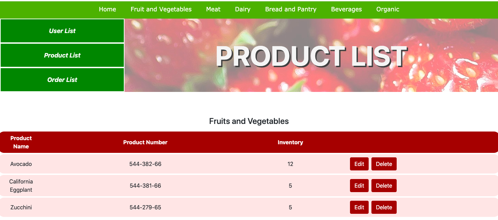

# GroceryStore
FreshFamily Market is a grocery store website project. This project was completed during my SOEN287 course project with my team of 3.

# Authors
Militsa Bogdeva, Diana Afanasyev, Antoine Dufour-Blain

# URL
http://freshfamily-market.epizy.com/index.php

# Features
The website has a front page, product aisles, product pages, a registration page, login page. The website also has back end pages for displaying, and modifying users, products, and orders.

# My Work
Designed the website layout for both front end and back end.
Implemented the entire cart and item processing system to allow CRUD operations on the products and cart list

# Technologies
HTML, CSS, JavaScript, PHP, Bootstrap

Front End:

Back End:

# Backend access
Please use the following username and password to access the back end: username: admin@admin.com password: qqqq1111

